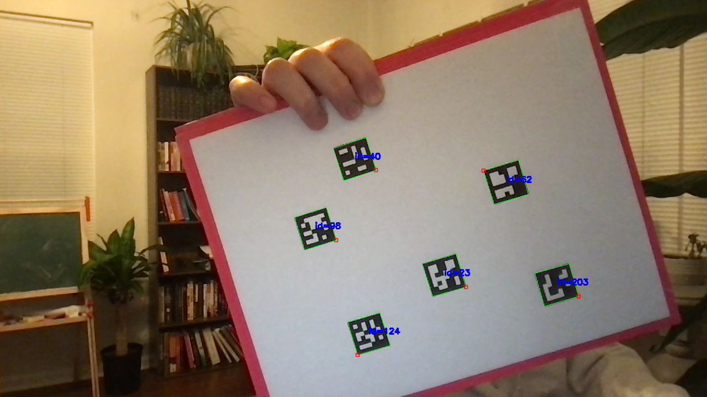

# Augmented Reality

## Task 1

-   [Aruco Marker Detection Tutorial](https://docs.opencv.org/4.x/d5/dae/tutorial_aruco_detection.html)
-   [`detectMarkers()`](https://docs.opencv.org/4.x/d2/d1a/classcv_1_1aruco_1_1ArucoDetector.html#a0c1d14251bf1cbb06277f49cfe1c9b61)
-   [`drawDetectedMarkers()`](https://docs.opencv.org/4.x/de/d67/group__objdetect__aruco.html#ga2ad34b0f277edebb6a132d3069ed2909)

For this task I decided to use the Aruco markers due to them being more stable and offer non-symmetric shapes which allows us to track the top left corner in any orientation.
"Calibrating using ArUco is much more versatile than using traditional chessboard patterns, since it allows occlusions or partial views."



## Task 2

-   [ArUco Board](https://github.com/opencv/opencv/blob/4.x/doc/tutorials/objdetect/aruco_board_detection/images/board.png)
-   [ChArUco Board](https://github.com/opencv/opencv/blob/4.x/doc/charuco_board_pattern.png)
-   [OpenCV ArUco Board Detection](https://docs.opencv.org/4.x/db/da9/tutorial_aruco_board_detection.html)
-   [OpenCV Camera Calibration](https://docs.opencv.org/4.x/d4/d94/tutorial_camera_calibration.html)
-   [OpenCV ArUco Calibration](https://docs.opencv.org/4.x/da/d13/tutorial_aruco_calibration.html)
-   [GitHub Camera Calibration](https://github.com/opencv/opencv/blob/4.x/samples/cpp/tutorial_code/calib3d/camera_calibration/camera_calibration.cpp)
-   <!-- You can find a ChAruco board pattern in https://github.com/opencv/opencv/blob/4.x/doc/charuco_board_pattern.png (7X5 ChAruco board, square size: 30 mm , marker size: 15 mm, aruco dict: DICT_5X5_100, page width: 210 mm, page height: 297 mm) -->

<!-- For task 2 OpenCV recommends using a ChArUco board for camera calibration as it is more precise than both the chessboard and ArUco boards. A benefit to using the ChArUco board is that it allows for occlusions and impartial views during camera calibration. --> The ChArUco board requires some refactoring of the code for it to work. Will come back to this later.

Instead of passing in an image, the calibration targets will be captured by the live video stream at different angles. Each time the user hits 's', the image will be saved in [/img/CameraCalibration].

The corners associated with it will be calculated during the calibration. This is necessary for calibrating the camera to then estimate prose. I jumped the gun on this earlier and tried to estimate prose without having the camera calibration criteria met.

Aruco markers being used have a size of 6x6

<!-- -w=5 -h=7 -l=100 -s=10 -d=10
-v=/path_to_opencv/opencv/doc/tutorials/objdetect/aruco_board_detection/gboriginal.jpg
-c=/path_to_opencv/opencv/samples/cpp/tutorial_code/objectDetection/tutorial_camera_params.yml
-cd=/path_to_opencv/opencv/samples/cpp/tutorial_code/objectDetection/tutorial_dict.yml -->

## Task 3

Camera calibration. I was collecting the corners incorrectly at first and not initializing the point set the right way. Originally, I was reinitializing the point set everytime we were trying to save a calibration image. This was incorrect because it wasn't providing a consistent base to compare the target corners to. I also was pushing only the first corner instead of all corners detected into the corner set at first.

_I was getting error messages during the camera calibration due to an assertion between the object points and the image points. I tried retaking the calibration images without flipping the board completely upside down and instead just taking screenshots at different angles and distances with the first corner maintaining its relative position when compared to the other corners._

```sh
Point Set Size: 140
Initial Camera Matrix: [1, 0, 0;
0, 1, 0;
0, 0, 1]
Saving frame
Calibration image saved
Marker Corners vs point_set:
Marker Corners: 35
Point Set: 140
Number of calibration images: 1
Number of corners: 1
Number of points: 1
Number of point sets: 140

Saving frame
Calibration image saved
Marker Corners vs point_set:
Marker Corners: 35
Point Set: 140
Number of calibration images: 2
Number of corners: 2
Number of points: 2
Number of point sets: 140

Saving frame
Calibration image saved
Marker Corners vs point_set:
Marker Corners: 35
Point Set: 140
Number of calibration images: 3
Number of corners: 3
Number of points: 3
Number of point sets: 140

Saving frame
Calibration image saved
Marker Corners vs point_set:
Marker Corners: 35
Point Set: 140
Number of calibration images: 4
Number of corners: 4
Number of points: 4
Number of point sets: 140

Saving frame
Calibration image saved
Marker Corners vs point_set:
Marker Corners: 35
Point Set: 140
Number of calibration images: 5
Number of corners: 5
Number of points: 5
Number of point sets: 140

Saving frame
Calibration image saved
Marker Corners vs point_set:
Marker Corners: 35
Point Set: 140
Number of calibration images: 6
Number of corners: 6
Number of points: 6
Number of point sets: 140

Calibrating camera
Parameters passed to camera calibration function:
Camera Matrix:
[1, 0, 0;
0, 1, 0;
0, 0, 1]
Distortion Coefficients: []
Image Size: [1280 x 720]
Point List Size: 6
Corner List Size: 6
Results from the calibration:
RMS: 144.114
Camera Matrix:
[151.6203986185967, 0, 539.488481643926;
0, 151.6203986185967, 332.1966861865517;
0, 0, 1]
Distortion Coefficients: [-0.01876109472949826, 0.0001439978612589976, 0.003788645099711373, 0.007662638459728349, -3.239925154500674e-07]
Rvecs: 6
Tvecs: 6
```

The images used for the above calibration are in [img/task_3](img/task_3)

---

Recreated the Aruco board instead of using the one provided by the documentation so that I would know the exact parameters that went into it.

Results from first calibration:

```sh
Calibrating camera
Parameters passed to camera calibration function:
Camera Matrix:
 [1, 0, 0;
 0, 1, 0;
 0, 0, 1]
Distortion Coefficients: [0;
 0;
 0;
 0;
 0;
 0;
 0;
 0]
Image Size: [1280 x 720]
Point List Size: 7
Corner List Size: 7

Results from the calibration:
Reprojection Error: 178.239
Camera Matrix:
 [205.5928395558909, 0, 639.645517284077;
 0, 205.5928395558909, 359.4054592449027;
 0, 0, 1]
Distortion Coefficients: [-0.05173143613094228;
 0.0006325430701229498;
 0.005765094464291955;
 -0.01825402569281661;
 -2.566613254766876e-06]
Focal Length 'fx': 205.593
Focal Length 'fy': 205.593
Principal Point 'u0': 639.646
Principal Point 'v0': 359.405
Rvecs: 7
Tvecs: 7

```

I modified the focal length in the initial camera matrix to be `frame.cols` instead of `1`. I also reduced the size of the dis coefficients from 8 to 5. FAILED

```sh
Calibrating camera
Parameters passed to camera calibration function:
Camera Matrix:
 [0, 0, 0;
 0, 0, 0;
 0, 0, 1]
Distortion Coefficients: [0;
 0;
 0;
 0;
 0]
Image Size: [1280 x 720]
Point List Size: 6
Corner List Size: 6

Results from the calibration:
Reprojection Error: nan
Camera Matrix:
 [nan, 0, nan;
 0, nan, nan;
 0, 0, 1]
Distortion Coefficients: [nan;
 nan;
 nan;
 nan;
 nan]
Focal Length 'fx': nan
Focal Length 'fy': nan
Principal Point 'u0': nan
Principal Point 'v0': nan
Rvecs: 6
Tvecs: 6
```

Moved the variable initialization to be performed after the first frame is captured.

```sh
Calibrating camera
Parameters passed to camera calibration function:
Camera Matrix:
 [1280, 0, 640;
 0, 1280, 360;
 0, 0, 1]
Distortion Coefficients: [0;
 0;
 0;
 0;
 0]
Image Size: [1280 x 720]
Point List Size: 6
Corner List Size: 6

Results from the calibration:
Reprojection Error: 123.633
Camera Matrix:
 [284.4113855971449, 0, 657.2708650288573;
 0, 284.4113855971449, 370.7546299768721;
 0, 0, 1]
Distortion Coefficients: [-0.08475806270843005;
 0.001977968335649451;
 -0.003275799228120908;
 0.00200010039964631;
 -1.323922445895045e-05]
Focal Length 'fx': 284.411
Focal Length 'fy': 284.411
Principal Point 'u0': 657.271
Principal Point 'v0': 370.755
Rvecs: 6
Tvecs: 6
```

Changed the focal length back to `1` instead of `frame.cols`.

```sh
Calibrating camera
Parameters passed to camera calibration function:
Camera Matrix:
 [1, 0, 640;
 0, 1, 360;
 0, 0, 1]
Distortion Coefficients: [0;
 0;
 0;
 0;
 0]
Image Size: [1280 x 720]
Point List Size: 5
Corner List Size: 5

Results from the calibration:
Reprojection Error: 99.9029
Camera Matrix:
 [261.0213652763136, 0, 628.9575005366416;
 0, 261.0213652763136, 362.9115271523518;
 0, 0, 1]
Distortion Coefficients: [-0.07778671729709283;
 0.001770995222786093;
 -0.0001349355051383821;
 0.002289855454145317;
 -1.211794839677911e-05]
Focal Length 'fx': 261.021
Focal Length 'fy': 261.021
Principal Point 'u0': 628.958
Principal Point 'v0': 362.912
Rvecs: 5
Tvecs: 5
```

Slightly modified how I am creating the point set. For 35 markers I should be getting a point set of size 140. Cannot seem to get the RMS value down under 99.

Removed the `CV::CALIB_FIX_ASPECT_RATIO` flag and made the error even higher.

```sh
Results from the calibration:
Reprojection Error: 265.157
Camera Matrix:
 [162.1560797922828, 0, 639.5053125972486;
 0, 448.3844115004588, 359.5031117328392;
 0, 0, 1]
Distortion Coefficients: [-0.03936041932382128;
 0.0003920274411193862;
 0.002640720418946475;
 -0.007073264020485122;
 -1.129373138457779e-06]
Focal Length 'fx': 162.156
Focal Length 'fy': 448.384
Principal Point 'u0': 639.505
Principal Point 'v0': 359.503
```

Replaced the `CV::CALIB_FIX_ASPECT_RATIO` flag in calibrateCamera. Reduced focal length to `frame.cols * 1.2` from `1.5`.

-   Reprojection Error: 136.751

Reduced focal length to `frame.cols`.

-   Reprojection Error: 128.081
-

Took another look at how I was generating the aruco board. After doing the manual calculations I realized that I was generating the wrong size board for calibration. I had boardSize set to `Size(500, 600)` and it needed to be set to `Size(560, 780)`. This is based on the parameters:

-   marker length = 100px
-   marker separation = 10px
-   marker margins = 10px
-   board width = 5
-   board height = 7

After those changes still getting a reprojection error of 201.23. Attempting to pass in the boardSize to calibrateCamera instead of the frameSize to see what happens.

```sh
Parameters passed to camera calibration function:
Camera Matrix:
 [1280, 0, 640;
 0, 1280, 360;
 0, 0, 1]
Distortion Coefficients: [0;
 0;
 0;
 0;
 0]
Image Size: [560 x 780]
Point List Size: 6
Corner List Size: 6

Results from the calibration:
Reprojection Error: 176.669
Camera Matrix:
 [74.25199464387669, 0, 279.5239947387621;
 0, 74.25199464387669, 389.4628797896039;
 0, 0, 1]
Distortion Coefficients: [-0.04368640609923428;
 0.0005379097216165003;
 0.00533784868539272;
 0.02074461983933977;
 -1.845885817082606e-06]
Focal Length 'fx': 74.252
Focal Length 'fy': 74.252
Principal Point 'u0': 279.524
Principal Point 'v0': 389.463
Rvecs: 6
Tvecs: 6
```

Comparing passing in image Size vs boardsize

ImageSize:

```sh
Parameters passed to camera calibration function:
Camera Matrix:
 [1280, 0, 640;
 0, 1280, 360;
 0, 0, 1]
Distortion Coefficients: [0;
 0;
 0;
 0;
 0]
Image Size: [1280 x 720]
Point List Size: 7
Corner List Size: 7

Results from the calibration:
Reprojection Error: 206.988
Camera Matrix:
 [282.2086175759212, 0, 639.4057031884823;
 0, 282.2086175759212, 359.4645022646836;
 0, 0, 1]
Distortion Coefficients: [-0.07477086573832603;
 0.001372020961362885;
 -0.0002137502827226283;
 -0.01273869310786715;
 -7.108247689467206e-06]
Focal Length 'fx': 282.209
Focal Length 'fy': 282.209
Principal Point 'u0': 639.406
Principal Point 'v0': 359.465
Rvecs: 7
Tvecs: 7
```

BoardSize:

```sh
Parameters passed to camera calibration function:
Camera Matrix:
 \[1280, 0, 640;
 0, 1280, 360;
 0, 0, 1\]
Distortion Coefficients: \[0;
 0;
 0;
 0;
 0\]
Image Size: \[560 x 780\]
Point List Size: 5
Corner List Size: 5

Results from the calibration:
Reprojection Error: 267.547
Camera Matrix:
 \[178.0067807971627, 0, 279.5000035065655;
 0, 178.0067807971627, 389.4999923878752;
 0, 0, 1\]
Distortion Coefficients: \[-0.02147757239973928;
 0.0001120867974737845;
 0.00232019426490443;
 0.004844222834624031;
 -1.497465842035556e-07\]
Focal Length 'fx': 178.007
Focal Length 'fy': 178.007
Principal Point 'u0': 279.5
Principal Point 'v0': 389.5
Rvecs: 5
Tvecs: 5
```

Does the order of marker Ids matter? What about the size?

### Chessboard

Calibration using chessboard was much more successful. Here are the results of the first calibration attempt.

```sh
Calibrating camera
Values pre-calibration:
Camera Matrix:
 [1, 0, 0;
 0, 1, 0;
 0, 0, 1]
Distortion Coefficients: 0 0 0 0 0
Values post-calibration:
Reprojection Error: 2.43454
Camera Matrix:
 [1232.5972, 0, 639.5;
 0, 1232.5972, 359.5;
 0, 0, 1]
Distortion Coefficients: 0.0512141 0.993731 0 0 0
Rotation Vectors: 7
Translation Vectors: 7
```

[findChessBoardCorners()](https://docs.opencv.org/4.x/d9/d0c/group__calib3d.html#ga93efa9b0aa890de240ca32b11253dd4a)

````xml
<camera_matrix type_id="opencv-matrix">
  <rows>3</rows>
  <cols>3</cols>
  <dt>f</dt>
  <data>
    1.10148401e+03 0. 6.39500000e+02 0. 1.10148401e+03 3.59500000e+02 0.
    0. 1.</data></camera_matrix>
<dist_coeffs type_id="opencv-matrix">
  <rows>5</rows>
  <cols>1</cols>
  <dt>f</dt>
  <data>
    1.84197560e-01 -2.61509955e-01 0. 0. 0.</data></dist_coeffs>
```


## Resources

-   [Parsing program options](https://medium.com/@mostsignificant/3-ways-to-parse-command-line-arguments-in-c-quick-do-it-yourself-or-comprehensive-36913284460f)
-   [OpenCV GitHub Repo](https://github.com/opencv/opencv/tree/4.x/samples)
-   [OpenCV Aruco github directories](https://github.com/opencv/opencv/tree/4.x/modules/objdetect/src/aruco)
-   [Youtube video on camera calibration](https://www.youtube.com/watch?v=E5kHUs4npX4&list=PLkmvobsnE0GHMmTF7GTzJnCISue1L9fJn&index=13)
````
